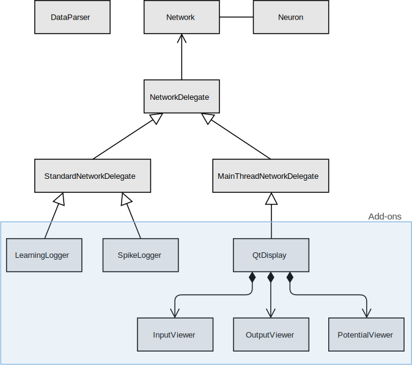

# Quick Start Guide

Adonis is a spiking neural network simulator coded using C++. There are currently two versions:  

**1. Adonis_t** : a clock-based version of the simulator which includes current dynamics  
**2. Adonis_e** : an event-based version of the simulator without current dynamics

## Dependencies

#### On macOS

###### Homebrew
Homebrew is used to easily install macOS dependencies. Open a terminal and run ``/usr/bin/ruby -e “$(curl -fsSL [https://raw.githubusercontent.com/Homebrew/install/master](https://raw.githubusercontent.com/Homebrew/install/master) install)”``

###### Premake 4
Premake 4 is used to build the project. Open a terminal and run ``brew install premake``

###### Qt (optional if no GUI is needed)
The Qt framework is needed when using the GUI to visualise the output of a neural network. The following has been tested with **Qt 5.11.1** and support cannot be guaranteed for other versions

**first option**  
Open a terminal and run ``brew install qt5``

**second option**

1. Download directly from https://www.qt.io/download/
2. Select the correct version of Qt
3. Make sure the Qt Charts add-on is selected
4. Open the premake4.lua file and modify the moc, include and library paths depending on where Qt was installed

#### On Linux (Debian and Ubuntu)

###### Premake 4
Premake 4 is used to build the project. Open a terminal and run ``sudo apt-get install premake4``

###### Qt (optional if no GUI is needed)
The Qt framework version 5.10 or newer is needed when using the GUI to visualise the output of a neural network. To install qt5 on Debian Buster, type the following:
``sudo apt-get install qt5-default libqt5charts5 libqt5charts5-dev libqt5qml5 qtdeclarative5-dev qml-module-qtcharts``

This should get you going in terms of dependencies. If your distribution does not support that version (Debian Stretch bundles 5.7), consider downloading the latest Qt manually. The following has been tested with **Qt 5.11.1**.

1. Download directly from https://www.qt.io/download/
2. Select the correct version of Qt
3. Make sure the Qt Charts add-on is selected
4. Open the premake4.lua file and modify the moc, include and library paths depending on where Qt was installed
5. Open the .bashrc file in your home directory and add these lines:
```
LD\_LIBRARY\_PATH=[path to the Qt dynamic lib]
export LD\_LIBRARY\_PATH
```

## Testing

1. Go to the Adonis directory and run ``premake4 gmake && cd build && make`` or ``premake4 --without-qt gmake && cd build && make`` in case we do not want any Qt dependencies

2. execute ``cd release && ./testNetwork`` to run the spiking neural network

**_Disclaimer: some of the applications bundled in with the simulator use a path relative to the executable to use one of the files present in the data folder. As such, executing ``./release/testNetwork`` instead of ``cd release && ./testNetwork`` could lead to an error message when the relative path is set incorrectly_**

#### Premake Actions and Options

###### Using xCode on macOS
To use Xcode as an IDE on macOS, go the Adonis base directory and run ``premake4 xcode4``

###### Building Without Qt
In case you do not want to use the Qt GUI, you can build Adonis without any Qt dependencies by running ``premake4 --without-qt gmake`` instead of ``premake4 gmake``

###### Premake Help
Run ``premake4 --help`` for more information

## Using The Simulator

#### Adonis UML Diagram
The Adonis simulator is a header-only C++ library with 12 classes



#### Adonis_t
all the classes are declared within the ``adonis_t`` namespace. Check out testNetwork.cpp for more information on how to build and run a spiking neural network.

###### Important includes
* add ``#include "../source/network.hpp"`` to use the base framework
* any add-ons being used also need to be included. If I want to use the Qt Display for instance, I would add ``#include "../source/qtDisplay.hpp"``

###### Reading Input data
* the DataParser class is capable of reading 1D input data formatted in a text file as such: _timestamp, index_
* It can also read 2D data formatted as such: _timstamp, X, Y_

This is done via the **readData()** method which take in a string for the location of the input data file, and an int for the width of the 2D square grid in the case of 2D data.

the output is a vector of struct with 4 fields: timestamp, neuronID, x, y.

###### Initialisation

_Initialising the optional Add-ons_

* the QtDisplay is initialised as such: ``adonis_t::QtDisplay qtDisplay;``
* the SpikeLogger and the LearningLogger both take in an std::string as a parameter, to define the name of their corresponding output file. They are initialised as such:
```
adonis_t::SpikeLogger spikeLogger(std::string("spikeLog"));
adonis_t::LearningLogger learningLogger(std::string("learningLog"));
```
_Initialising The Network_

* if no add-ons are used we can directly initialise the network as such: ``adonis_t::Network network``

* the Network class can take in a vector of references for the standard delegates:
``adonis_t::Network network({&spikeLogger, &learningLogger});``

* the Network class can also take in a reference to a main thread delegate (only 1 main thread add-on can be used):
``adonis_t::Network network(&qtDisplay);``

* if both types of add-ons are being used then we initialise as such:
``adonis_t::Network network({&spikeLogger, &learningLogger}, &qtDisplay);``

###### Creating The Network
**TBA**

###### Connecting The Network
**TBA**

###### Injecting Spikes
**TBA**

###### Qt Display Settings
The QtDisplay class has 4 methods to control the settings:

* **useHardwareAcceleration()** : a bool to control whether to use openGL
* **trackLayer()** : an int to track a specific layer
* **trackNeuron()** : an int to track a specific neuron via its ID
* **setTimeWindow()** : a double that defines the time window of the display

###### Running The Network
to run the network use the Network class method run which takes the _runtime_ and the _timestep_ as parameters: ``network.run(runtime, timestep);``
