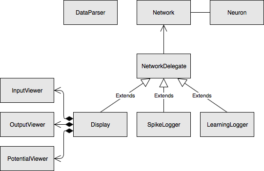

# Quick Start Guide

Adonis is a spiking neural network simulator coded using C++. There is currently one version, with another event-based version in the works:  

** Adonis_t** : a clock-based version of the simulator which includes current dynamics  


Adonis is a fast, lightweight and flexible spiking neural network simulator made specifically for pattern recognition tasks. Adonis makes it very simple to change/add learning rules without having to dig into the specifics of the code. So far, only leaky integrate and fire neurons are supported, as the usefulness of more complicated models is debatable in pattern recognition. The neuron model support will be updated as my research progresses. 

Finally, Adonis allows full usage of both weight and conduction delays for pattern recognition

## Dependencies

#### On macOS

###### Homebrew
Homebrew is used to easily install macOS dependencies. Open a terminal and run ``/usr/bin/ruby -e “$(curl -fsSL [https://raw.githubusercontent.com/Homebrew/install/master](https://raw.githubusercontent.com/Homebrew/install/master) install)”``

###### Premake 4
Premake 4 is used to build the project. Open a terminal and run ``brew install premake``

###### Qt (optional if no GUI is needed)
The Qt framework is needed when using the GUI to visualise the output of a neural network. The following has been tested with **Qt 5.11.1** and support cannot be guaranteed for other versions

**first option**  
Open a terminal and run ``brew install qt5``

**second option**

1. Download directly from https://www.qt.io/download/
2. Select the correct version of Qt
3. Make sure the Qt Charts add-on is selected
4. Open the premake4.lua file and modify the moc, include and library paths depending on where Qt was installed

#### On Linux

###### Premake 4
Premake 4 is used to build the project. Open a terminal and run ``sudo apt-get install premake4``

###### Qt (optional if no GUI is needed)
The Qt framework version 5.9 or newer is needed when using the GUI to visualise the output of a neural network. To install qt5 on Debian Buster or Ubuntu 18.04, type the following:
``sudo apt-get install qt5-default libqt5charts5 libqt5charts5-dev libqt5qml5 qtdeclarative5-dev qml-module-qtcharts qml-module-qtquick-controls``

This should get you going in terms of dependencies. If your distribution does not support that version (Debian Stretch bundles 5.7), consider downloading the latest Qt manually. The following has been tested with **Qt 5.11.1**.

1. Download directly from https://www.qt.io/download/
2. Select the correct version of Qt
3. Make sure the Qt Charts add-on is selected
4. Open the premake4.lua file and modify the moc, include and library paths depending on where Qt was installed
5. Open the .bashrc file in your home directory and add these lines:
```
LD\_LIBRARY\_PATH=[path to the Qt dynamic lib]
export LD\_LIBRARY\_PATH
```

## Testing

1. Go to the Adonis directory and run ``premake4 gmake && cd build && make`` or ``premake4 --without-qt gmake && cd build && make`` in case we do not want any Qt dependencies

2. execute ``cd release && ./testNetwork`` to run the spiking neural network

**_Disclaimer: some of the applications bundled with the simulator use a path relative to the executable to use one of the files present in the data folder. As such, executing ``./release/testNetwork`` instead of ``cd release && ./testNetwork`` could lead to an error message when the relative path is set incorrectly_**

#### Premake Actions and Options

###### Using xCode on macOS
To use Xcode as an IDE on macOS, go the Adonis base directory and run ``premake4 xcode4``

###### Building Without Qt
In case you do not want to use the Qt GUI, you can build Adonis without any Qt dependencies by running ``premake4 --without-qt gmake`` instead of ``premake4 gmake``

###### Premake Help
Run ``premake4 --help`` for more information

## Using The Simulator

#### Adonis UML Diagram
The Adonis simulator is a header-only C++ library with 12 classes



#### Adonis_t
all the classes are declared within the ``adonis_t`` namespace. Check out testNetwork.cpp for more information on how to build and run a spiking neural network.

###### Important includes
* add ``#include "../source/network.hpp"`` to use the base framework
* any add-ons being used also need to be included. If I want to use the Qt Display for instance, I would add ``#include "../source/qtDisplay.hpp"``

###### Reading Input data
* the DataParser class is capable of reading 1D input data formatted in a text file as such: _timestamp, index_
* It can also read 2D data formatted as such: _timstamp, X, Y_

This is done via the **readData()** method which take in a string for the location of the input data file, and an int for the width of the 2D square grid in the case of 2D data.

the output is a vector of struct with 4 fields: **timestamp**, **neuronID**, **x**, **y**.

###### Initialisation

_Initialising the optional Add-ons_

* the QtDisplay is initialised as such: ``adonis_t::QtDisplay qtDisplay;``
* the SpikeLogger and the LearningLogger both take in an std::string as a parameter, to define the name of their corresponding output file. They are initialised as such:
```
adonis_t::SpikeLogger spikeLogger(std::string("spikeLog"));
adonis_t::LearningLogger learningLogger(std::string("learningLog"));
```
_Initialising The Network_

* if no add-ons are used we can directly initialise the network as such: ``adonis_t::Network network``

* the Network class can take in a vector of references for the standard delegates:
``adonis_t::Network network({&spikeLogger, &learningLogger});``

* the Network class can also take in a reference to a main thread delegate (only 1 main thread add-on can be used):
``adonis_t::Network network(&qtDisplay);``

* if both types of add-ons are being used then we initialise as such:
``adonis_t::Network network({&spikeLogger, &learningLogger}, &qtDisplay);``

###### Creating The Network

* to create neurons defined in a 1D space, we use the Network method **addNeurons()** method

* to create neurons defined in a 2D square grid (for computer vision tasks), we use the Network method **addReceptiveFields()** method which creates a grid where each square in that grid contains a separate neuron population. This method allows the network to retain spatial information

* an important parameter in the methods to create neurons is the learning rule selection via the enumeration **learningMode** defined in the Neuron class. Check it out to see all the available learning rule options.

###### Connecting The Network

* the network getter **getNeuronPopulations()** returns a vector of neuron populations that we just created. This getter returns a struct with 3 fields: **rfNeurons** a vector of neurons belonging to a population, **rfID** the ID of a receptive field in case the **addReceptivefields()** method was used, and **layerID** the ID of the layer a population belongs to.

* the network method **allToAllConnectivity()** connects all neurons of a presynaptic population with all neurons from a posynaptic population. It has 7 parameters:

1. a reference to a presynaptic neuron population
2. a reference to a postsynaptic neuron population
3. a bool to randomise the projection weights around a value
4. the weight value in question
5. a bool to randomise the projection delays around a value
6. the delay value in question
7. a bool to allow redundant connectivity (more than one projection between a set of neurons)

the following is an example of connectivity between 2 layers, with fixed weights, random delays with a maximum value of 20, and no redundant connectivity:
```
network.allToAllConnectivity(&network.getNeuronPopulations()[0].rfNeurons, &network.getNeuronPopulations()[1].rfNeurons, false, weight, true, 20, false);
```

###### Injecting Spikes

* to inject a spike in a neuron we need to use the network method **injectSpike()** on a neuron. The neuron has to be defined as an input neuron via the Neuron class method **prepareInitialSpike** which takes in the timestamp of the spike. In the testNetwork.cpp you can find an example of how this looks:

```
network.injectSpike(network.getNeuronPopulations()[0].rfNeurons[0].prepareInitialSpike(10));
```
 here we inject a spike at timestamp 10 (a.u) for the first neuron in the first neuron population created.

* if we are using an input data file we can loop through the input data vector (check reading input data section) to  find the neuron that has to spike and the spike timestamp. When using 1D data the spiking neuron is simply the neuron ID. For 2D data we have to search in the neuron population for the correct neuron using its x y coordinates (an example of that can be seen in the receptiveFieldsTest.cpp).

* we can stop learning at any time by calling the network method: **turnOffLearning(double timestamp)** which takes in a timestamp to disable the learning rules. This is useful in case we want to start injecting spikes from testing / cross-validation datasets.

###### Qt Display Settings
The QtDisplay class has 4 methods to control the settings:

* **useHardwareAcceleration()** : a bool to control whether to use openGL
* **trackLayer()** : an int to track a specific layer
* **trackNeuron()** : an int to track a specific neuron via its ID
* **setTimeWindow()** : a double that defines the time window of the display

###### Running The Network
to run the network use the Network class method run which takes the _runtime_ and the _timestep_ as parameters: ``network.run(runtime, timestep);``